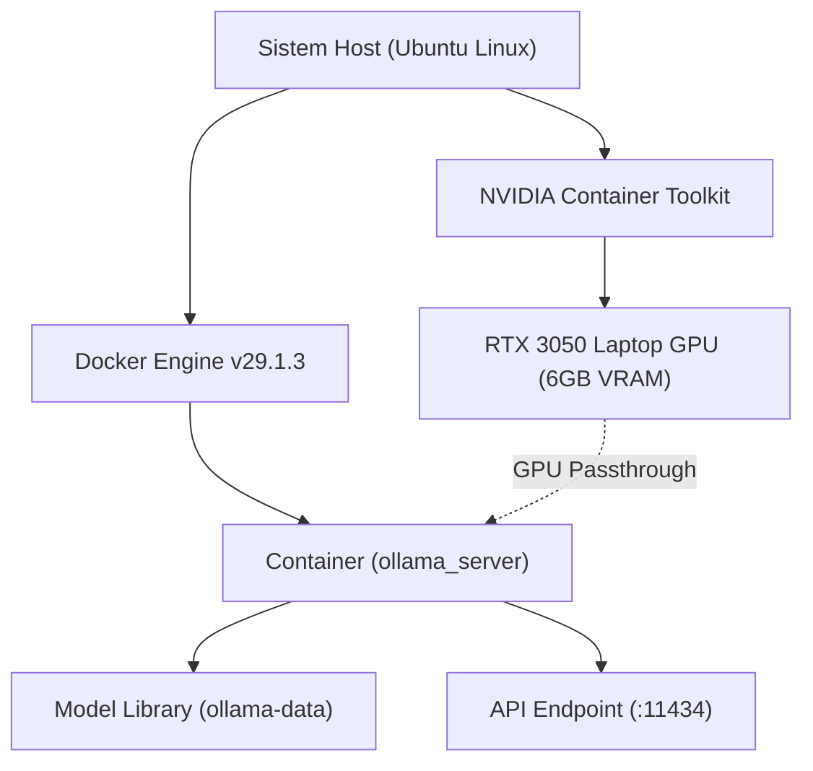

# Analisis Sistem & Performa Ollama (Docker GPU)

Dokumen ini berisi hasil analisis, arsitektur setup, data performa, dan panduan pengelolaan untuk layanan Ollama yang dijalankan via Docker dengan dukungan GPU NVIDIA.

---

## 1. Arsitektur Infrastruktur

Layanan Ollama diorkestrasi menggunakan Docker Compose dengan *hardware passthrough* untuk NVIDIA GPU agar proses inferensi berjalan optimal dengan akselerasi perangkat keras.



### Rincian Konfigurasi Container:
* **File Konfigurasi:** [docker-compose.yml](file:///home/nusa/Project/ollama/docker-compose.yml)
* **Image:** `ollama/ollama:latest`
* **Nama Container:** `ollama_server`
* **Port Mapping:** `11434:11434`
* **Volume Persistensi:** `./ollama-data:/root/.ollama` (menyimpan seluruh unduhan model agar tidak hilang)

---

## 2. Spesifikasi Perangkat Keras Host

| Komponen | Spesifikasi | Detail Status |
| :--- | :--- | :--- |
| **GPU** | NVIDIA GeForce RTX 3050 Laptop GPU | Aktif (Driver: 595.71.05, CUDA 13.2) |
| **VRAM** | 6 GB GDDR6 | Tersedia ~5.6 GiB untuk beban komputasi |
| **Sistem Operasi** | Linux (Ubuntu) | Menjalankan Docker Engine v29.1.3 |

> [!TIP]
> NVIDIA Container Toolkit telah terkonfigurasi dengan benar di Docker, memungkinkan Ollama mendeteksi langsung CUDA0 dan memanfaatkan VRAM secara penuh.

---

## 3. Pustaka Model AI (Model Catalog)

Berikut adalah daftar model yang saat ini terpasang di dalam container Ollama (`/root/.ollama/models`):

| Nama Model | Ukuran File | VRAM Minimum | Karakteristik / Rekomendasi Penggunaan |
| :--- | :---: | :---: | :--- |
| **`gemma3:1b`** | 815 MB | ~1.2 GB | Sangat ringan, cepat, ideal untuk respons instan pada perangkat berspesifikasi rendah. |
| **`qwen2.5:3b`** | 1.9 GB | ~2.5 GB | Menawarkan keseimbangan yang baik antara ukuran dan akurasi, sangat optimal untuk tugas umum & bahasa Indonesia. |
| **`llama2:latest`** | 3.8 GB | ~4.5 GB | Model 7B klasik dari Meta untuk pemahaman teks umum. |
| **`qwen2.5vl:3b`** | 3.2 GB | ~4.0 GB | Model Vision-Language 3B parameter, handal untuk OCR dan pemahaman gambar. |
| **`moondream:latest`** | 1.7 GB | ~2.2 GB | Model Vision-Language yang sangat kecil dan cepat, cocok untuk analisis visual dasar. |
| **`qwen2.5:latest`** | 4.7 GB | ~5.5 GB | Model 7B modern dengan performa tinggi pada tugas penalaran, koding, dan multibahasa. |


---

## 4. Analisis & Benchmark Performa

Pengujian inferensi dilakukan menggunakan model **`gemma3:1b`** (Q4_K_M quantization) dengan mengirimkan prompt uji: `"Hi, how are you?"`.

### Hasil Metrik Inferensi:
* **Model Layer Offload:** `27/27 layers` (100% diproses di GPU).
* **Alokasi VRAM Model:**
  * Bobot Model (Weights): **762.5 MiB**
  * KV Cache: **38.0 MiB**
  * Grafik Komputasi (Compute Graph): **80.0 MiB**
  * Total Alokasi: **~880.5 MiB**
* **Durasi Load Awal (Cold Start):** `23.86 detik` (waktu memuat model dari SSD ke VRAM).
* **Kecepatan Inferensi:** **~143.08 token per detik** (`77 token` dibuat dalam `538 ms`).

> [!NOTE]
> Kecepatan sebesar **143 token/detik** membuktikan akselerasi GPU CUDA berjalan 100% aktif. Jika berjalan di CPU saja, kecepatan rata-rata model 1B biasanya hanya berkisar di 15-30 token/detik.

---

## 5. Panduan Operasional & Pemeliharaan

Gunakan perintah-perintah berikut di direktori `/home/nusa/Project/ollama` untuk mengelola layanan:

### Memulai & Menghentikan Layanan
```bash
# Menjalankan container di latar belakang
docker compose up -d

# Menghentikan container
docker compose down

# Melihat status container yang aktif
docker compose ps
```

### Mengelola Model AI
```bash
# Melihat daftar model yang terpasang
docker compose exec ollama ollama list

# Mengunduh model baru (contoh: deepseek-coder)
docker compose exec ollama ollama pull deepseek-coder

# Berinteraksi langsung dengan model via terminal
docker compose exec ollama ollama run gemma3:1b
```

### Monitoring & Debugging
```bash
# Melihat log aktivitas server secara real-time
docker compose logs -f

# Memeriksa penggunaan resource GPU di dalam host
nvidia-smi
```
